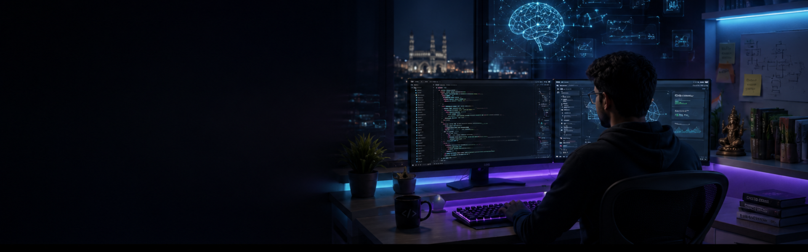

<picture>
  <source media="(prefers-color-scheme: dark)" srcset="./assets/banner-dark.png">
  <source media="(prefers-color-scheme: light)" srcset="./assets/banner-light.png">
  
</picture>

 

 

  
  
  

  
  
  
  

👋 About Me

I'm Krishna Sai Teja, a Full Stack Web Developer focused on building modern web applications from interface to API, database, and deployment.

I enjoy turning ideas into products that are useful, responsive, maintainable, and production-minded — while continuously improving my understanding of backend architecture, AI, cloud, and system design.

Role:       Full Stack Web Developer
Focus:      MERN · Next.js · REST APIs · Modern Web Apps
Building:   Full-stack products and developer-focused projects
Learning:   AI · System Design · Docker · AWS · DevOps
Principles: Clean UX · Maintainable Code · Scalable Architecture

What I Work On

🚀 Building full-stack applications with modern JavaScript ecosystems

🎨 Designing responsive interfaces with attention to UX and accessibility

⚙️ Building REST APIs and backend services with practical architecture

🗄️ Working with SQL and NoSQL databases and data modeling

🧠 Exploring AI/ML and integrating intelligent features into applications

☁️ Learning cloud infrastructure, DevOps, containers, and system design

## 🛠️ Tech Stack

<table width="100%">
<tr>

<td width="600" valign="top">

<h3>Frontend</h3>

</td>

<td width="600" valign="top">

<h3>Backend</h3>

</td>

</tr>

<tr>

<td width="600" valign="top">

<h3>AI / ML</h3>

</td>

<td width="600" valign="top">

<h3>Tools</h3>

</td>

</tr>
</table>

🚀 Featured Projects

<table width="100%">
<tr>
<td width="33%" valign="top">

<h3 align="center">🎓 EduPredict</h3>

AI-powered student performance platform combining attendance, assignments, academic analytics, and performance prediction in a teacher & student portal.

</td>

<td width="33%" valign="top">

<h3 align="center">🚚 Delivor Backend</h3>

MVC-structured REST API for a delivery platform with authentication, user/vendor flows, CRUD operations, and modular middleware.

</td>

<td width="33%" valign="top">

<h3 align="center">🤖 AI / ML Models</h3>

A collection of AI and machine-learning experiments exploring model development, prediction, and practical implementations.

</td>
</tr>
</table>

  <a href="https://github.com/KrishnaSaiTejaSandalla?tab=repositories">View all repositories →</a>
  &nbsp;·&nbsp;
  <a href="https://krishna-sai-teja-portfolio.vercel.app/">Explore my portfolio →</a>

📊 GitHub Activity

<!-- GitHub Streak -->

 
<!-- GitHub Statistics + Most Used Languages -->

<table width="100%">
<tr>

<td width="50%" align="center" valign="middle">

</td>

<td width="50%" align="center" valign="middle">

</td>

</tr>
</table>

 

🐍 Contribution Snake

<picture>
  <source media="(prefers-color-scheme: dark)" srcset="https://raw.githubusercontent.com/KrishnaSaiTejaSandalla/KrishnaSaiTejaSandalla/output/github-snake-dark.svg">
  <source media="(prefers-color-scheme: light)" srcset="https://raw.githubusercontent.com/KrishnaSaiTejaSandalla/KrishnaSaiTejaSandalla/output/github-snake.svg">
  
</picture>

 
Generated automatically by the <a href="https://github.com/Platane/snk">snk</a> GitHub Action.
 

 

🌱 Currently Leveling Up

  

 

🤝 Let's Build Something

<b>Have an idea, project, internship opportunity, or collaboration in mind?</b>

I'm always interested in building useful products, solving interesting engineering problems, and learning from people who build at a high level.

 

  

<i>Build it. Ship it. Improve it.</i>

  

Designed & maintained by <b>Krishna Sai Teja</b> · Thanks for stopping by.

 

