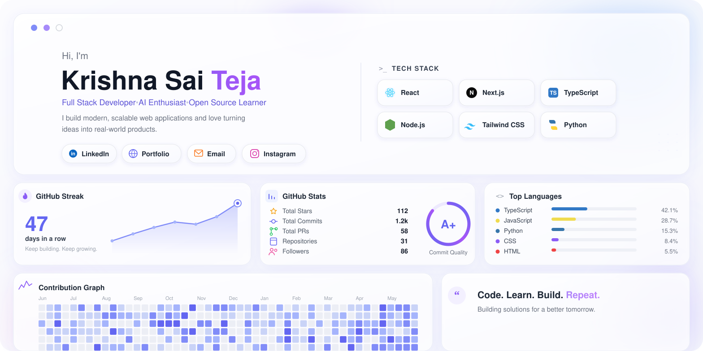

<h1 align="center">Hi, I'm Krishna Sai Teja Sandalla 👋</h1>

<h3 align="center">CSE (AI) Student · Full-Stack Developer · Building AI-powered projects</h3>

  

  
  
  

---

### 🚀 Currently Working On

- 🧠 AI-powered applications
- 🌐 Full-stack development using MERN / Next.js
- 🤖 Machine learning projects
- ☁️ Exploring cloud deployment and scalable systems

### 🛠️ Tech Stack

  

---

### 📌 Featured Projects

<picture>
  <source media="(prefers-color-scheme: dark)" srcset="dark.svg">
  <source media="(prefers-color-scheme: light)" srcset="light.svg">
  
</picture>

> Cards are generated from live GitHub data — see [`fetch_data.py`](fetch_data.py), [`generate_projects.py`](generate_projects.py) and [`projects.yml`](projects.yml) below to regenerate them.

- 🎓 [Edupredict](https://github.com/KrishnaSaiTejaSandalla/Edupredict) — AI-assisted education platform (Next.js, TypeScript, Drizzle ORM)
- 🏔️ [NorthPeak-Digital](https://github.com/KrishnaSaiTejaSandalla/NorthPeak-Digital) — Modern digital agency / business site
- 🎵 [Spotify-clone](https://github.com/KrishnaSaiTejaSandalla/Spotify-clone) — Spotify-inspired music player UI (React, Tailwind, Context API)
- 👟 [nike-store](https://github.com/KrishnaSaiTejaSandalla/nike-store) — Nike-inspired e-commerce storefront UI
- 🌀 [Echoes](https://github.com/KrishnaSaiTejaSandalla/Krishna-s/tree/main/Echoes) — project inside the Krishna-s repository

---

### 📊 GitHub Stats

  
  

  

  

---

### 📫 Reach Me

- 💼 [LinkedIn](https://www.linkedin.com/in/krishna-sai-teja-sandalla-47b98a304/)
- ✉️ [krishnasaitejasandalla@gmail.com](mailto:krishnasaitejasandalla@gmail.com)
- 🐙 [GitHub](https://github.com/KrishnaSaiTejaSandalla)

<i>📍 Vadodara, India</i>

